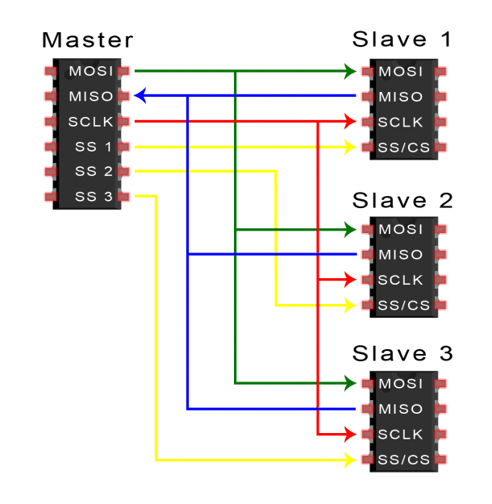

# Bitwise Masks #

AVR like ATmega are commonly LSB 0, the Least Significant BIT is bit 0 and the Most Significant BIT is bit 7.

```c
//Check status of bit

unsigned int bit = 2; //starts in 0, assumes 
unsigned int bitmask = (1 << bit);

unsigned int value = B10011101;
unsigned int ok = (value & bitmask) == bitmask);
unsigned int ok = (value & bitmask) >> bit; 
```

```c
//Set a bit

unsigned int bit = 2; //starts in 0, assumes 
unsigned int bitmask = (1 << bit);

unsigned int value = 0;
value = (value | bitmask); 

//Unset a bit
//use a bitwise not ~ to change to 1 every bit that we do not want changed, and 0 for the bit we want to change.
value = (value | ~bitmask); 
```


# Register Control of Ports #

The arduino has three port, Port B, Port C (also serves as analog inputs) and Port D.

Each port has an output register: `PORTB`, `PORTD` and `PORTC` are the 8 bit register for each port. 

The function `digitalPinToPort(pin)` returns the corresponding port number, Port B is number 2, Port C is number 3 and Port D is number 4

Each bit in a register corresponds to a PIN in the board. For example bit 0 on Port B corresponds to pin 8 on the board, and bit 5 in Port D corresponds to pin 5 on the board.


Each port has a direction register: `DDRB`, `DDRC` and `DDRD`.

```c
//Traditional pin manipulation
pinMode(8, OUTPUT); //Pin D8 on board
digitalWrite(8, HIGH);

```

```c
//Using Port Register
DDRB = B00000001; //set bit 0 to OUTPUT, bit 0 corresponds to PIN 8
PORTB = B00000001; //sets bit 0 HIGH, which corresponds to PIN 8
```

Using `DDRB = B00000001;` has one problem, it sets bit 0 to OUTPUT but it also sets the rest to INPUT. Setting a PIN to INPUT/OUTPUT is done safetly by using bitwise operations:

```c
//only sets bit 0 as output, the rest keep their current state
DDRB = DRD | B00000001;
```

The macro `digitalPinToBitMask(pin)` can be used to obtain a bit mask for a pin.

```c
//only sets bit 0 as output, the rest keep their current state
unsigned int maskbitPin8 = digitalPinToBitMask(8);
DDRB = DRD | maskbitPin8;
```

When manipulating the ports using its register you MUST be careful to understand what pins you use and modify. For example in Port D, the pins 0 and 1 are used for the UART/USB serial, if you modify the direction (INPUT/OUTPUT) the serial will stop working. 

Another consideration is that using the port register directly may not work on other AVR with different port registers. The following code uses [portOutputRegister(port)](https://garretlab.web.fc2.com/en/arduino/inside/hardware/arduino/avr/cores/arduino/Arduino.h/portOutputRegister.html) to

```c
//Port Numbers PA=1,PB=2,PC=3,PD=4,PE=5,PF=6,PG=7,PH=8,PJ=10,PK=11,PL=12 
unsigned int port = 2; ///Port B 
out = portOutputRegister(port); //out is a pointer to an uint8_t, in this case &PORTB

unsigned int maskbitPin8 = digitalPinToBitMask(8);

//set high
*out = out | maskbitPin8;

//set low
*out = out & ~maskbitPin8;
```

The above code will be complete if we consider interrupts, we should turn off interrups off while we write to the port to ensure an interrupt does not change the value of our output register. The full code will be:


```c
//Port Numbers PA=1,PB=2,PC=3,PD=4,PE=5,PF=6,PG=7,PH=8,PJ=10,PK=11,PL=12 
unsigned int port = 2; ///Port B 
out = portOutputRegister(port); //out is a pointer to an uint8_t, in this case &PORTB

unsigned int maskbitPin8 = digitalPinToBitMask(8);

uint8_t oldSREG = SREG; //save contents of the status register (SREG) which has the interrupt indicator. 
cli(); //disable interrupts

//set high
*out = out | maskbitPin8;

SREG = oldSREG; //restore SREG to its original state
```


[Port manipulation](https://www.arduino.cc/en/Reference/PortManipulation)<br>
[Understanding digitalWrite()](https://garretlab.web.fc2.com/en/arduino/inside/hardware/arduino/avr/cores/arduino/wiring_digital.c/digitalWrite.html)<br>
[portOutputRegister(port)](https://garretlab.web.fc2.com/en/arduino/inside/hardware/arduino/avr/cores/arduino/Arduino.h/portOutputRegister.html)<br>

# Componets #


## Serial 1 ##

Serial 1 is the USB port of the board.


## Serials ##

| BOARD | PORT | RX | TX |
| -- | -- | -- | -- |
| MEGA | D | 19 | 18 |
| UNO | D | 0 | 1 |


## Set the direction register ##

```c
// set pins 8..13 as output...
DDRB = B00111111;  // digital pins -,-,13,12,11,10,9,8
        
DDRB |= B00000100;        //Sets D10 as OUTPUT
DDRB &= B00000100;
```

```c
// Write simultaneously to pins 8..13...
PORTB = B00111000;   // turns on 13,12,11; turns off 10,9,8
```        

## SPI ##



Serial Peripheral Interface (SPI) is a synchronous serial data protocol used by Microcontrollers for communicating with one or more peripheral devices quickly over short distances. It can also be used for communication between two microcontrollers. SPI is easy to build based on shift registers and provide many advantages to traditional serial communications.

It differs from traditional serial communications in that is uses one line for the data and one line for the clock. The receiver is always in sync because it uses the clock signal to now when to read or send data.

The SPI bus refers to the wires that connect the master device to the slave devices.

Each master and slave device uses 4 pins.

### Master Out Slave In (MOSI, COPI, SDI) ###

The connection for the master device to send data to the slave device. "MOSI" is "Master Out/Slave In", also "COPI" for "Controller Out/Peripheral In". In a slave device we my find SDI or DI. 

### Master In Slave Out (MISO, SDO) ###

The connection for the slave device to send data back to the master device. Commonly known as *SDO* "Slave Data Out",or *DO* for "Data Out" in a slave device. 

### Serial Clock (SCLK, SCL, SCK) ### 

The line that carries the clock pulse generated by the master device.

### Chip Select ###

Slave Select/Chip Select (SS/CS) is the connection used by the master device to inform the slave device that it will send or request data. The SS/CS pin should be set to LOW to inform the slave that the master will send or request data. Otherwise, it is always HIGH

Each device has its own CS line/pin. When the pin is high the device is not active and when low the device will activate and will send or receive data.

To talk to a particular peripheral, you'll make that peripheral's CS line low and keep the rest of them high.


### Configuration ###

The SPI control register `SPCR` has 8 bits, each of which control a particular SPI setting. 

| 7 | 6 | 5 | 4 | 3 | 2 | 1 | 0 |
| -- | -- | -- | -- | -- | -- | -- | -- |
| SPIE | SPE  | DORD | MSTR | CPOL | CPHA | SPR1 | SPR0 |

The function of each bit is as follows:

| Bit | Description |
| -- | -- |
| 7 | **SPIE, SPI Interrupt Enable = 0**<br>If it is set to 1 the SPI will generate an interrupt. The `SPIF` (contant in Arduino) bit in the `SPSR` Register is set once a whole byte was shifted (read/written). The SPI clock will stop. | 
| 6 | **SPE, SPI Enable = 1**<br>When the SPE bit is one, the SPI is enabled. This bit must be set to enable any SPI operations. |
| 5 | **DORD, Data Order = 0**<br>When the DORD bit is one (DORD = 1), the LSB of the data word is transmitted first, otherwise the MSB of the data word is transmitted first. In Arduino there is a constant named `DORD` that has the bit position (0x5, B00000101) of the DORD in the SPCR. |
| 4 | **MSTR, Master/Slave Select = 1**<br>This bit selects Master SPI mode when set to one, and Slave SPI mode when cleared. |
| 3 | **CPOL**<br>Sets the data clock to be idle when high if set to 1, idle when low if set to 0. |
| 2 | **CPHA**<br>Samples data on the falling edge of the data clock when 1, rising edge when 0. | 
| 1 | **SPR1**<br>Combined with *SPR0* these two bits sets the divider for the SPI's clock speed. 00 is fastest (4MHz) 11 is slowest (250KHz). |
| 0 | **SPR0**<br>Combined with *SPR1* these two bits sets the divider for the SPI's clock speed. 00 is fastest (4MHz) 11 is slowest (250KHz). |

The `SPI` class (`#include <SPI.h>`) provides multiple methods to configure the control register. There are several things we need to know about an SPI interface to be able to configure the SPI bus.

#### Is data shifted in most-significant *MSB* or least-significant *LSB* first? ####
This is the endianness used to assamble the bits sent or received. The default in ATmega is 0 (constant `MSBFIRST`).

Use `SPI.setBitOrder(order)` to set the bit order to least-significant *LSB* or most-significant *MSB*. Valid values are `LSBFIRST` (0) or `MSBFIRST` (1) defined in *SPI.h*.

This function sets the DORD bit (bit 5, 0x20, B00100000) of the `SPCR` register


#### Clock Polarity & Clock Phase? ####

How is the data transmitted relative to the clock (data setup and data sampled). 

The clock polarity indicates whether the clock line is high or low when idle. A value of 0 means that the clock idle state will be low, a value of 1 is the opposite.

The clock phase indicates if the data is sampled on the falling edge or on the rising edge. SPI communications are synced by the clock line which oscillates between low and high. An action (read/write) on the bus can happen either in the *rising* (the clock goes from low to high), or the *falling* (the clock goes from high to low).

> The term *clock edge* is used to refer to the clock phase, as in the *falling edge* and *rising edge*.


Use `SPI.setDataMode(mode)` to change the mode. The default is `SPI_MODE0`.

ATmega Modes:

| Mode | Arduino | Mask Value | Clock Polarity<br>(CPOL bit) | Clock Phase<br>(CPHA bit) | Leading Edge | Trailing Edge |
| -- | -- | -- | -- | -- | -- | -- |
| 0 | `SPI_MODE0` | 0x00, B00000000 | 0 | 0 | Sample Rising | Setup Failing |
| 1 | `SPI_MODE1` | 0x04, B00000100 | 0 | 1 | Setup Rising | Sample Failing |
| 2 | `SPI_MODE2` | 0x08, B00001000 | 1 | 0 | Sample Failing | Setup Rising |
| 3 | `SPI_MODE3` | 0x0C, B00001100 | 1 | 1 | Setup Failing | Sample Rising |


```c
//Behind the scenes:
#define SPI_MODE_MASK 0x0C  // CPOL = bit 3, CPHA = bit 2 on SPCR

SPCR = (SPCR & ~SPI_MODE_MASK) | mode;
```

#### What speed is the SPI running at? ####

The clock frecuency of the SPI pulse is a proportion of the board's Oscillator clock frecuency (FOSC), that is the clock can be 1/2, 1/4, 1/8. 1/16, 1/32, 1/64, or 1/128. Each proportion corresponds to a combination of the SPR1 and SPR0 bits on the SPCR.

| Proportion | SPR1 | SPR0 | SPI2X | Bit |
| -- | -- | -- | -- | -- |
| 1/2 | 0 | 0 | 0 | 0x0, 0, B0000 |
| 1/4 | 0 | 0 | 1 | 0x1, 1, B0001 |
| 1/8 | 0 | 1 | 0 | 0x2, 2, B0010 |
| 1/16 | 0 | 1 | 1 | 0x3, 3, B0011 |
| 1/32 | 1 | 0 | 0 | 0x4, 4, B0100 |
| 1/64 | 1 | 0 | 1 | 0x5, 5, B0101 |
| 1/128 | 1 | 1 | 1 | 0x7, 7, B0111 |

Using `SPSettings` or `SPI.setClockDivider()`  sets the SPR1 and SPR0 bits of the SPCR and the SPI2X of the SPSR.

Using `SPSettings` you indicate a desired clock frequency up to the boards frequency. The code will find a the closests corresponding proportion.

```c
speedMaximum = 4000000; // One fourth of the 16Mhz 
SPISettings mySettting(speedMaximum, MSBFIRST, SPI_MODE0);

SPI.beginTransaction(mySettting);
```

Using `SPI.setClockDivider()` you specify the actual divider like `0`, `1`, `3` ... `7`.

The clock is always set on the Master. 

The default speed of a clock in SPI is either the board's Oscillator clock frecuency (FOSC) or 4000000.

```c
//Behind the scenes
#define SPI_CLOCK_MASK 0x03  // SPR1 = bit 1, SPR0 = bit 0 on SPCR
#define SPI_2XCLOCK_MASK 0x01  // SPI2X = bit 0 on SPSR

SPCR = (SPCR & ~SPI_CLOCK_MASK) | (clockDiv & SPI_CLOCK_MASK);
SPSR = (SPSR & ~SPI_2XCLOCK_MASK) | ((clockDiv >> 2) & SPI_2XCLOCK_MASK);
```


**NOTE:** The new way to setup SPI in Arduino is to use [`SPISettings`](https://www.arduino.cc/en/Reference/SPISettings).<br><br>
For example: `SPISettings mySettting(speedMaximum, dataOrder, dataMode);`

## SPI Internals ##

The `SPCR` is the SPI's Control Register. The `SPDR` register holds the data recieved or sent. The `SPSR` register holds the bus status. 

Implementation of SPI is mainly found in [SPI.h](https://github.com/arduino/ArduinoCore-avr/blob/master/libraries/SPI/src/SPI.h).


# References #
[Basic SPI](https://www.arduino.cc/en/reference/SPI)<br>
[Good introduction](https://www.arduino.cc/en/Tutorial/SPIEEPROM)<br>
[Sparkfun tutorial](https://learn.sparkfun.com/tutorials/serial-peripheral-interface-spi/introduction)<br>
[Atmega SPI in C++](http://web.csulb.edu/~hill/ee346/Lectures/19%20C++%20ATmega%20SPI%20Serial%20Comm.pdf)<br>
[SPI Tutorial at analog.com](https://www.analog.com/en/analog-dialogue/articles/introduction-to-spi-interface.html#)<br>
[SPI electronic considerations](https://www.pjrc.com/better-spi-bus-design-in-3-steps/)<br>
[Tutorial 1](https://electronoobs.com/eng_arduino_tut130.php)<br>
