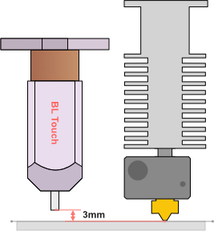
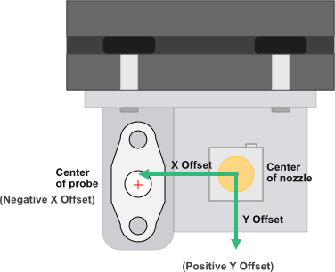
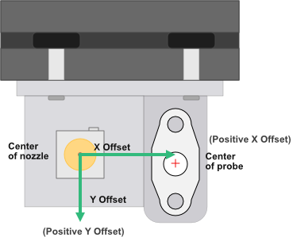
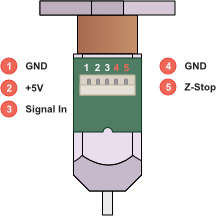
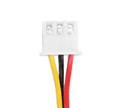
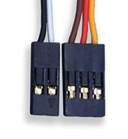
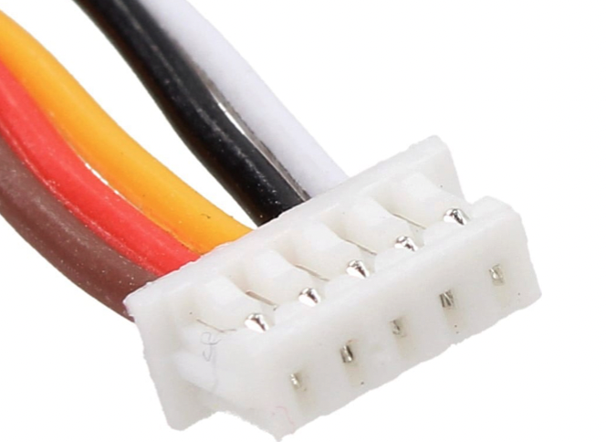
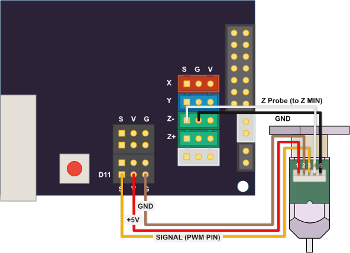

# BL-Touch

Auto-bed leveling (ABL) is an excellent feature for 3D printers that can very accurately level your bed with almost no manual effort. Auto-bed leveling uses a sensor, usually attached to the nozzle, to measure the height of your bed at different points. These measurements are then used to create a leveling mesh to ensure that the nozzle maintains the same distance from the bed at all points during printing and thus compensating for warped bed or bad level.
Using an auto leveling sensor means that your prints are less susceptible to a bed that is not properly level or warps on the bed.
BL-Touch uses a hall sensor to detect minute movements of a probe pin against the surface of your printer bed. The BL-Touch was created by [ANTCLABS](https://www.antclabs.com/home) and it is one of the most popular sensors used for ABL.
When using a  BL-Touch you still need to level your bed properly, but perhaps not as often.
The quality of your BL-Touch sensor can vary drastically, buy an original from ANTCLABS or make sure you research the manufacturer very well and stick to well known brands on this one.
 
A BL-Touch may be confused with a 3D-Touch sensor. 3D-Touch is a sort of clone of the BL-Touch, they look the same and operate on the same principle/mechanics. The wiring has the same exact order but the colors of the wires can vary widely. They are pretty much interchangeable. The main difference is the quality of the materials. In general a quality 3D-Touch costs about the same as a quality BL-Touch, yet I found that BL-Touch are a bit more expensive.

## Placement

The sensor will be close to the hotend but not too close as to get damaged by the heat.
Search [Thingiverse](https://www.thingiverse.com/search?q=bl%2Btouch&pag=1&type=things) for a bracket to mount your sensor, notice that most fan shrouds also have brackets for the BL Touch.

The [Mini Satsana](https://www.thingiverse.com/thing:5139196) is a small fan duct that leaves space for a regular BLTouch bracket.

INCOMPLETE (waiting for my BLTouch)




### Distance from the bed

Lower your Z axis until your nozzle is touching the bed.
The placement of your BL Touch must be within 2.3mm to 4.3mm of the bed.
Move your BL Touch bracket up or down to ensure that the probe tip is 3mm from the bed (within 2.3mm to 4.3mm).

Tip: Use an item like a hex wrench (allen wrench) of a known height that's within that range as a spacer.

### Offset from Nozzle

In order to calibrate the position of our sensor we need to know the offsets of the probe center in relation to the center of the nozzle.



The offsets are dictated by the bracket/mount you use and the actual placement of the mount.

We need to measure the distance from the probe center to the nozzle center on the X-axis (from left-to-right when facing your printer) and the distance on the Y-axis (from back to front).

An X Offset to the left of the nozzle is always a negative value, if the sensor is on the right side of the nozzle it is a positive value.



If the probe is before the nozzle the Y Offset is a positive value and negative if it's behind the nozzle.

There are two ways to store these values in the firmware. We can modify the firmware (Configuration.h) to set them as default hardwire values, or we can use GCODE [M851](https://marlinfw.org/docs/gcode/M851.html) to set the values.


# Wiring

<span class="note_err"><b>DO NOT DESTROY YOUR BOARD!</b><br>
Pay attention to actual cable order and connection in the following wiring diagrams.<br>DO NOT make any assumptions about cable colors and order.</span>

Commonly a BL Touch will bring a cable with one connector (5 pin XH2.54/female or an SM2.54 connector) that plugs on the back of the BL Touch sensor and then splits into two connectors on the other end.

The 3 wire connector (Pins 1,2,3)(3 pins Dupont connector) connects to our Servo 0 connector in the board.

While the 2 wire connector (Pins 4, 5)(2 pins Dupont or XH2.54/female connector) connects to our Z-Min connector in the board.

NOTE: Do not buy a BL-Touch sensor with wires soldered directly to the back pcb.



`Pin 3` is used to control the BL-Touch. The firmware sends commands using PWM. In RAMPS boards this is connected to pin D11 (Servo 0).

`Pin 1` and `Pin 2` provide power to the electronics on the BL-Touch. Usually your Servo 0 connector on your RAMPS board has a 3 pin connector that includes GND and +5V.

`Pin 5` replaces your Z-Endstop which is usually a Z-Min (Z-). `Pin 5` connects to your signal pin in your boards Z-Min connector and `Pin 4` to the ground pin on the same connector.

In some boards you will see the markings "S" for signal, "V" for +5v, and "G" for ground.

**Side Note:** A BL-Touch cable is usually Orange, Brown, Red, White and Black while 3D-Touch sensors use Orange, Yellow, Green, Blue and Black. Both have the same wiring.

In most cases you need to buy a long cable [extension](https://www.antclabs.com/accessories) for your BL-Touch kit.

Depending on which BL-Touch you buy and the mainboard of your printer the connectors used will vary. Buy an extension cable with the connectors you need or replace the connectors as needed. When you buy an extension cable make sure it matches to the connector on the BL-Touch and your motherboard.

| Connectors | Notes |
| --- | --- |
|  | **XH2.54 Connector**<br>Z-MIN connectors on the mainboard usually use this connector.<br><br>The BL-Touch sensor may come with a 5 pin XH2.54 connector or a SM2.54.<br><br>Creality 32bit boards come with a dedicated 5-pin XH2.54 connector for the BL-Touch sensor. |
|  | **Dupont Connector**<br>The Servo 0 connector on the mainboard usually uses this connector.<br><br>Cables provided by BL-Touch kits usually have dupont connectors on the board end.<br><br>To reorder the cables in this connector just pull up the plastic tab holding the metal connector using a tweezer or other small object, then pull out the cable. Re-insert the cables in the needed order.<br><br>Creality 32bit boards come with a dedicated 5-pin XH2.54 connector for the BL-Touch sensor. |
|  | **SM2.54**<br>Some BL-Touch Sensors use this 5 pin connector on the sensor instead of a XH2.54. |

## Wiring to the Sunlu S8



Wiring [Sunlu S8 Stock Mainboard](sunlus8.md) ([RAMPS 1.4](ramps_mainboard.md), 8bit)<br>
*(Warning: Colors of cables may/will be different.)*

# Marlin Firmware

**Step 1.** The minimum changes to your Configuration.h file to get the BL-Touch working are as follow:

1.1. Enable BLTOUCH. Uncomment or add this line:

`#define BLTOUCH`

1.2. Uncomment Z_MIN_PROBE_USES_Z_MIN_ENDSTOP_PIN:

`#define Z_MIN_PROBE_USES_Z_MIN_ENDSTOP_PIN`

This indicates that our z-probe cables (pin 4 and 5) are connected to our Z-endstop in the mainboard.

This line must be commented (to disable it) when using a board that has a dedicated auto bed leveling connector (5-pin).

1.3. Uncomment AUTO_BED_LEVELING_BILINEAR (More Info):

`#define AUTO_BED_LEVELING_BILINEAR`

1.4. Uncomment Z_SAFE_HOMING:

`#define Z_SAFE_HOMING`

This option forces the Z homing to take place in the middle of the bed.

**Step 2.** To enable the auto bed leveling menus on your LCD uncomment LCD_BED_LEVELING:

`#define LCD_BED_LEVELING`

**Step 3.** To help leveling you can optimize your firmware to use babystepping together with a new Z-Offset wizard on the LCD menu. Babystepping allows us to make small adjustments to our z-axis.

Change the following in your `Configuration_adv.h`.

3.1. Enable babystepping:

`#define BABYSTEPPING`

3.2. Enable BABYSTEP_DISPLAY_TOTAL:

`#define BABYSTEP_DISPLAY_TOTAL`

3.3. Enable BABYSTEP_ZPROBE_OFFSET:

`#define BABYSTEP_ZPROBE_OFFSET`

3.4. Enable the wizard on the LCD:

`#define PROBE_OFFSET_WIZARD`

3.5. Set a start value for PROBE_OFFSET_WIZARD_START_Z:

`#define PROBE_OFFSET_WIZARD_START_Z -4.0`

**Step 4.** Tell the firmware where your BL-Touch is in relation to your nozzle tip. Change the following fields with the actual measured offsets in mm.

Negative values are for a sensor on the left of the nozzle and positive values for a sensor to the right of the nozzle.

With version1.x of the firmware we change the following:

```c
#define X_PROBE_OFFSET_FROM_EXTRUDER -22
#define Y_PROBE_OFFSET_FROM_EXTRUDER 0
#define Z_PROBE_OFFSET_FROM_EXTRUDER -3
```

With a newer version 2.x of the firmware we use the following:

```c
/* Specify a Probe position as { X, Y, Z } */
#define NOZZLE_TO_PROBE_OFFSET { -22, 0, -3 }
```

More [info](https://marlinfw.org/docs/gcode/M851.html) on setting the probe offset.

## Digging deeper... 

By default a BL Touch is assumed to use pin `D11` (a PWM pin) commonly known as "Servo 0" on RAMPS like boards.

In Marlin each board has a  pins_BOARDNAME.h where "boardname" is the actual name of the board used in Marlin (see list of boards here).
  
Your board is defined in your Configuration.h file in a line like this:

```c
#ifndef MOTHERBOARD
  #define MOTHERBOARD BOARD_RAMPS_14_EFB
#endif
```

In this case the file `pins_RAMPS.h` will be used by Marlin. In this file we will find a line like this:

```c
#define SERVO0_PIN 11    //RAMPS 1.4
```

Marlin knows which servo to use for Z probe using the following line in Configuration.h:

```c
/* Z Servo Probe*/
#define Z_PROBE_SERVO_NR 0   //default is zero
```

On RAMPS like boards `Z_MIN_PIN` is  pin number 18. The `Z_MIN_PIN` is configured in your `pins_MKS_BASE.h` file or your corresponding board file.

> Note: A [MKS Gen L V1](sunlus8.md) and similar clones like [Sunlu S8 mainboard](sunlus8.md) are basically [RAMPS 1.4/1.6](ramps_mainboard.md) boards where the ATMEGA 2560 is bundle in a single board.<br><br>In Marlin Firmware 1.x the file `pins_MKS_BASE.h` all it does is include the `pins_RAMPS.h` file. Actual pins will be defined inside `pins_RAMPS.h`.

> Note: In Marlin Firmware 2.x Sunlu S8's mainboard is configured as `BOARD_RAMPS_14_EFB` which will load `ramps/pins_RAMPS.h`.
