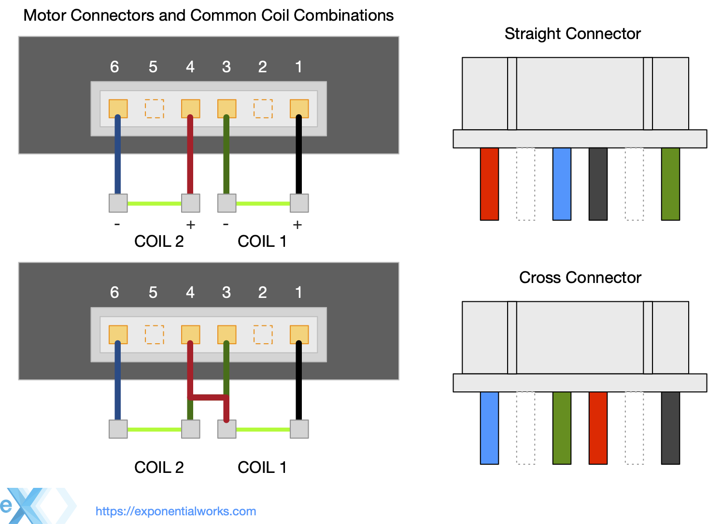
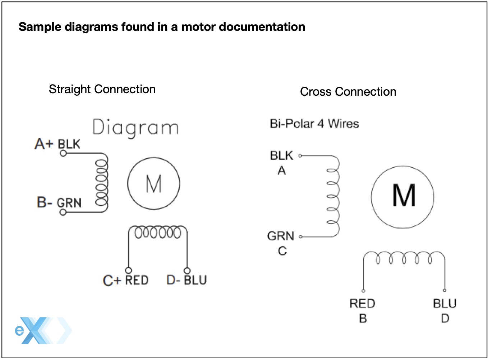
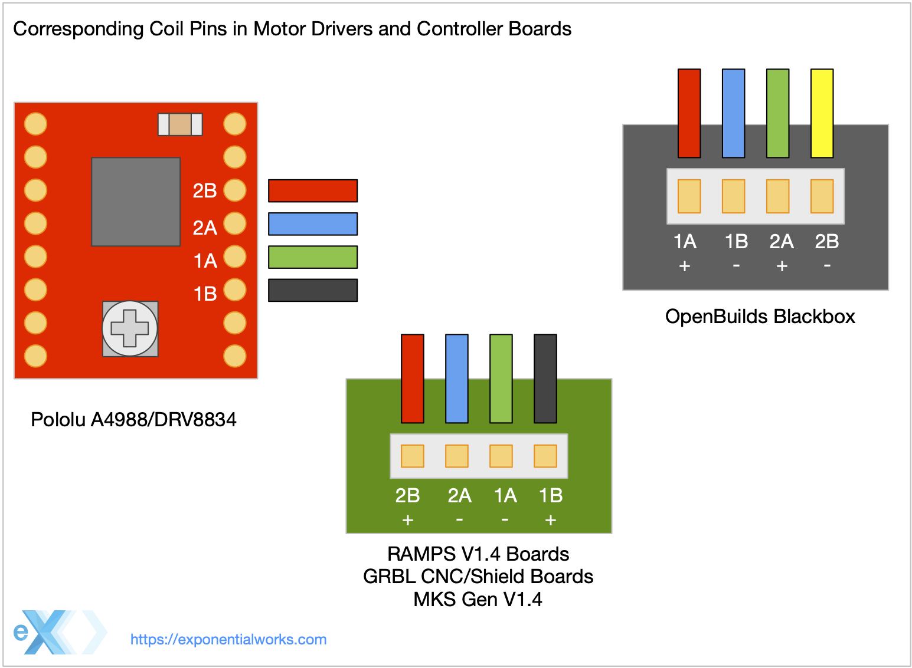

# Motors #

When selecting a stepper motor the basic considerations are:

The mounting size/specification for example NEMA-17, NEMA-23, etc.

The current draw per phase. Your stepper motor drivers or board dictates the limit of current it can provide to the motor (for example a common Driver like a A4988 (Pololu) provides from 1A to 1.2A).

The volatage supported, for example for 0 to 4V.

The force it can produce. The main metrics for this is the **holding torque** (For example 3.2 kg-cm, You will also find this in Newtons or oz-in). In 3D printing an average of 44 N·cm is quite enough for most designs.

The steps is how accurtly it can move. This is given in degrees per step or steps per revolution. For example in 3D printing an average NEMA17 motor used is 1.8 or 1.9 degrees with 200/400 steps per revolution. If a motor makes a 1.8degree rotation in one step, then to complete one revolution (that is 360 degrees in a circle) it will take 200 steps.

To learn more check this [wiki](https://reprap.org/wiki/Stepper_motor) page.

## NEMA ##

NEMA defines the dimensional specifications of a motors mounting face, thats the spacing of screws, the size of the opening and the size of the screews. The depth, width and other shapes and features are at the discretion of the motor manufacturer. So NEMA only guarantees that a particular NEMA motor will mount a specific mount designed for it, while actual clearance to the sides and back will also have to be considered when selecting a motor.

Usually in the maker space and 3DPrinting a NEMA motor is a short hand to refer to a bi-polar stepper motor with microstepping.

The NEMA standard defines alot of things, but pretty much all you can trust with a motor 

### NEMA 17 ##

NEMA 17 defines a face plate of 43.18 x 43.18 mm. Its the size of motor commonly used in 3D printers. 
 

## WIRING ##

> **Important** This section is for 4 wire bi-polar stepper motors.

In a 4 wire motor that is not pre-wired you usually have a (JST-XH) six pin connector in the motor. The cable will have a 4 pin connector on the other end that matches the connector on the control board. From the six pins only four are used on the connector.

As shown on the picture above you will see the two common connections I have found in motors. A basic stepper motor has two coils each running as a phase, thats why they are a two phase motor. The important thing of wiring a motor is to get the pin combination for each coil and wire each coil to your motor driver or control board. 

Since the motor has two coils (2 phases motors), each coil has two pairs of cables. Like shown on the above picture the trick is to identify what pin in the motor corresponds to a pair. At least I have found only those two combinations but there are more.

The other thing with the two cables in a pair is their polarity. The polarity tells the direction of the spin. There is not such thing as wrong direction instead the direction is dictated by how is the motor used and the control board. For this reason in many motor diagrams you will NOT see polarity specified as is left for the implementation of the design to select the default direction. 

> **Note** With most controller boards in 3D Printers and GRBL Shields fliping the connector changes the spin direction. In many 3D printing firmwares (eg Marlin) changing the direction as desired is as simple changing a configuration value. In CNC shields for GRLB you usually find a jumper to change the direction of an axis. If the connector can not be flipped you may just uses a tweezer to loose the pins and flip the order.

In many cases the wrong direction is a trivial thing to correct, it can be fix by reversing the conector to the driver, inverting the cables in a pair or using the configuration of the firmware in your controller board. 

> Word of caution! The cable colors on a stepper motor are NOT a standard DO NOT asume a color combination or order, specially when buying a replacement motor on the internet. I do find that a lot of cables do use black-green for one pair and red-blue for the other.

When looking for a motor documentation online you may find the pins listed as "Coil 1", "Coil 2", "Coil 3" and "Coil 4", in this case "Coil 1" and "Coil 2" is a pair and "Coil 3" and Coil 4" is the second pair. In some instances you will find the letters "A", "B", "C" and "D" which in my experience identify the actual pins in the connector. For example:

In the other hand when looking at the documentation of Pololu drivers and control boards you will see **1A**, **1B** and **2A**, **2B** when referencing the pins of each coil (or similar using A and B). You will mainly see this in documentation for [Pololu drivers](https://www.pololu.com/file/0J450/A4988.pdf) use in CNC/GRBL and 3D printing control boards.

Reference [RepRap Wiki](https://reprap.org/wiki/Stepper_wiring) 

## Identifying stepper motor coil wires #

If you dont have the pint out of the coils the main sign of a motor thats wired incorrectly is that it will vibrate/shake and will not turn. This is because both phases are spinning in the opposite direction locking the spin.

Which pair connects to which coil does not matter as long as you have the two cables of one pair going to one coil. A common error is to have one cable from one pair going to the other coil and vice-versa.

Using a multimeter in continuity (resistance/diodo test mode) you can test the combinations of pins until you find the pair that belongs to one coil. In continuity test you will have a low resistance value, some multimiters beep or read "short/closed" to indicate when you found a pair. Use the first picture as reference to first check if you have a straight or crossed pin out that are quite common.

> **Hint** If you are swapping a motor in an printer or equipment already wired and if the new motor came with a cable, then check both ends to see which are the pairs you will see if a cable is crossed or changed order in one end, usually you have to do the same order swap in the motor end of your exiting motor connector.  Using the tip of a tweezer or needle you can get the pins out or your connector and swap the order.

One way to test is you have a coil wired is to start testing two pins at a time in order. If you have a pair the motor will lock. Once you have the two pairs if your motor runs backward just revert the order of wires.

As a note as long as the pairs are correct which cable goes to each side of the two pins on a pair does not matter, with many 3D printers the connector on the board can be easily be flip to reverse the the polarity if the motor spins in the wrong direction. You may Really can b the only thing that matter are that the two wire for a particular pair connect to one coil in the motor and that you do not have one cable for one pair going to each coil (mix).

[Here](https://reprap.org/wiki/Stepper_wiring) is an excellent guide on wiring motors.

## RAMPS Boards ##

For more info on motor compatibility with RepRap boars check this wiki [entry](https://reprap.org/wiki/NEMA_17_Stepper_motor).
