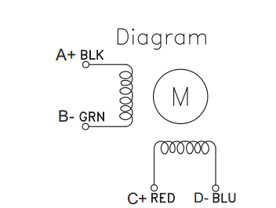

# Motors #

When selecting a stepper motor the basic considerations are:

The mounting size/specification for example NEMA-17, NEMA-23, etc.

The current draw per phase. Your stepper motor drivers or board dictates the limit of current it can provide to the motor (for example a common Driver like a A4988 (Pololu) provides from 1A to 1.2A).

The volatage supported, for example for 0 to 4V.

The force it can produce. The main metrics for this is the **holding torque** (For example 3.2 kg-cm, You will also find this in Newtons or oz-in). In 3D printing an average of 44 N·cm is quite enough for most designs.

The steps is how accurtly it can move. This is given in degrees per step or steps per revolution. For example in 3D printing an average NEMA17 motor used is 1.8 or 1.9 degrees with 200/400 steps per revolution.

## NEMA ##

NEMA defines the dimensional specifications of a motors mounting face, thats the spacing of screws, the size of the opening and the size of the screews. The depth, width and other shapes and features are at the discretion of the motor manufacturer. So NEMA only guarantees that a particular NEMA motor will mount a specific mount designed for it, while actual clearance to the sides and back will also have to be considered when selecting a motor.

### NEMA 17 ##

NEMA 17 defines a face plate of 43.18 x 43.18 mm. Its the size of motor commonly used in 3D printers. 
 

## WIRING ##

> **Important** This section is mainly for 4 wire stepper motors.

Lets start with cable colors on a stepper motor are NOT an standard and while you may find connectors with the "black-green-red-blue" colors, DO not use the colors and their order to assume all motors are wired the same.

The following picture is an example of the pin out of a NEMA 17 motor: 

Motor have two coils (2 phases motors), each coil has two pairs of cables. Like shown on the above picture the trick is to identify or to find out what pin in the motor corresponds to a pair. 

When looking for a motor documentation online you may find the pins listed as "Coil 1", "Coil 2", "Coil 3" and "Coil 4", in this case "Coil 1" and "Coil 2" is a pair and "Coil 3" and Coil 4" is the second pair.

If you dont have the pint out of the coils the main sign of a motor thats wired incorrectly is that it will vibrate and will not turn. This is because both phases are spinning in the opposite direction locking the spin.

Usually the pins in the motor are in order with the two pairs of coils. Meaning that **Pin 1** and **Pin 2** is one coil and **Pin 2** and **Pin 3** is the second coil.

> **Hint** If you are swapping a motor in an printer or equipment already wired and if the new motor came with a cable both ends to see which are the pairs you will see if a cable is crossed or changed order in one end, usually you have to do the same order swap in the motor end of your exiting motor connector.  

One way to test is you have a coil wired is to start testing two pins at a time in order. If you have a pair the motor will lock. Once you have the two pairs if your motor runs backward just revert the order of wires.

As a note as long as the pairs are correct which cable goes to each side of the two pins on a pair does not matter, with many 3D printers the connector on the board can be easily be flip to reverse the the polarity if the motor spins in the wrong direction. You may Really can b the only thing that matter are that the two wire for a particular pair connect to one coil in the motor and that you do not have one cable for one pair going to each coil (mix).

[Here](https://reprap.org/wiki/Stepper_wiring) is an excellent guide on wiring motors.

## RAMPS Boards ##

For more info on motor compatibility with RepRap boars check this wiki [entry](https://reprap.org/wiki/NEMA_17_Stepper_motor).
