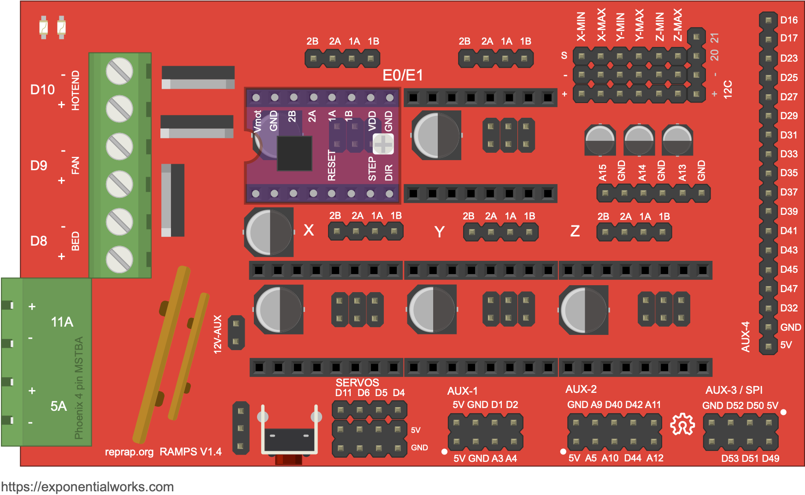
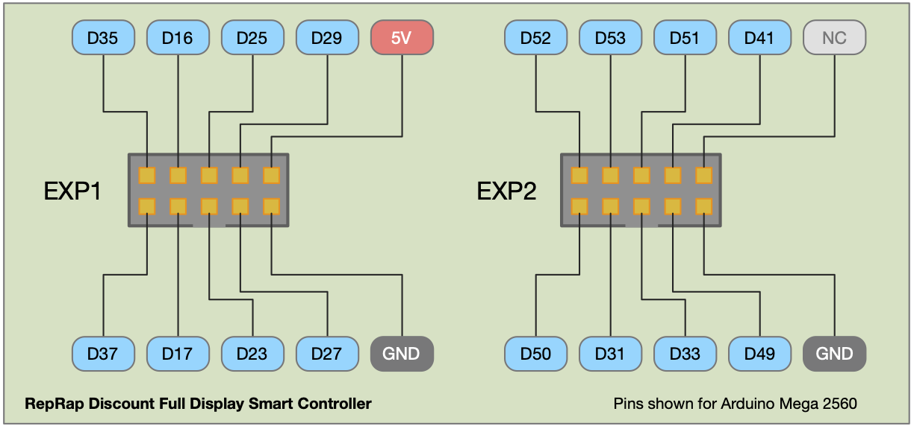
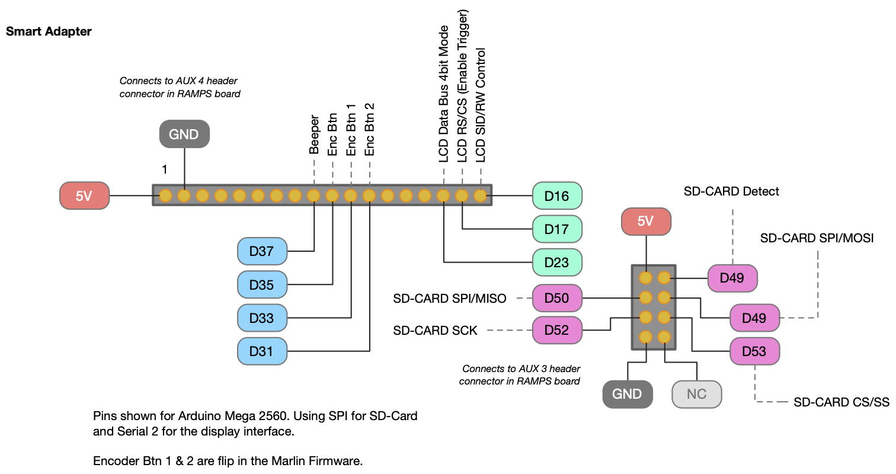

A lot of boards used on 3D printers are direct decendant of RAMPS, and many are actually clones with different layouts, dedicated connectors or you will find minimal electrical changes (mosfest, power regulators, etc) but in excence they are the same and use the same pins as RAMPS. In many you will find that firmwares like Marlin simply treat them like RAMPS.



# Pinout of RAMPS based Boards #

| Pin Name | Pin Number | Description | Ramps 1.x | Robo3D Ramps | Sunlo S8 | Marlin 1.x | Marlin 2.x |
| -- | -- | -- | -- | -- | -- | -- | -- |
| D10 | 10 | 23PWM | Extruder 0 | 10 | 10<br>(On an R1+ board it may be labeled R1+ D9, but it uses D10) | 10 | HEATER_0_PIN | |
| D8 | 8 | Hotbed | 8 | 8 | 8 | HEATER_BED_PIN | |
| D9 | 9 | Print Cooling Fan | 9 | 9 | 9 | FAN_PIN | |
| D38 | 38 | X Motor, Enable Pin | 38 | 38 | 38 | X_ENABLE_PIN | |
| A0  | 54 | X Motor, Step Pin | 54 | 54 | 54 | X_STEP_PIN | |
| A1  | 55 | X Motor, Direction Pin | 55 | 55 | 55 | X_DIR_PIN | |
| D3  | 3 | X Axis, Min End Stop | 2 | 2 | 2 | X_MIN_PIN | |
| D2  | 2 | X Axis, Max End Stop | 2 | -1 (NP) | 2 | X_MAX_PIN | |
| D56 | 56 | Y Motor, Enable Pin | 56 | 56 | 56 | Y_ENABLE_PIN | |
| A6  | 60 | Y Motor, Step Pin | 60 | 60 | 60 | Y_STEP_PIN | |
| A1  | 61 | Y Motor, Direction Pin | 61 | 61 | 61 | Y_DIR_PIN | |
| D14  | 14 | Y Axis, Min End Stop | 14 | 14 | 14 | Y_MIN_PIN | |
| D15  | 15 | Y Axis, Max End Stop | 15 | -1 (NP) | -1 (NP) | Y_MAX_PIN | |
| A8 | 62 | Z1 Motor, Enable Pin | 62 | 62 | 62 | Z_ENABLE_PIN | |
| D46  | 46 | Z1 Motor, Step Pin | 46 | 46 | 46 | Z_STEP_PIN | |
| D48  | 48 | Z1 Motor, Direction Pin | 48 | 48 | 48 | Z_DIR_PIN | |
| D18  | 18 | Z1 Axis, Min End Stop | 18 | 18 | 18 | Z_MIN_PIN | |
| D19  | 19 | Z1 Axis, Max End Stop | 19 | -1 (NP) | 19 | Z_MAX_PIN | |
| D24 | 24 | E0 Motor, Enable Pin | 24 | 24 | 24 | E0_ENABLE_PIN | |
| D26  | 26 | E0 Motor, Step Pin | 26 | 26 | 26 | E0_STEP_PIN | |
| D28  | 28 | E0 Motor, Direction Pin | 28 | 28 | 28 | E0_DIR_PIN | |
| D30 | 30 | Z2 Motor, Enable Pin | 30 | 30 | 30 | Z2_ENABLE_PIN | |
| D36  | 36 | Z2 Motor, Step Pin | 36 | 36 | 36 | Z2_STEP_PIN | |
| D34  | 34 | Z2 Motor, Direction Pin | 34 | 34 | 34 | Z2_DIR_PIN | |
| D30 | 30 | E1 Motor, Enable Pin | 30 | 30 | 30 | E1_ENABLE_PIN | |
| D36  | 36 | E1 Motor, Step Pin | 36 | 36 | 36 | E1_STEP_PIN | |
| D34  | 34 | E1 Motor, Direction Pin | 34 | 34 | 34 | E1_DIR_PIN | |

> Pin value of `-1` means unused or unset. A pin with `NP` means there is no physical connector or not present on board. A pin with `WI` means connection is internally wired in the PCB no accesible PIN is available.


> On Ramps 1.X there are 4 stepper drivers. The fourth driver was originally specified for a second extruder (E1). In many boards its usually either use for the additional extruder or for a second Z motor on a dual motor setup.
 
> Uses Arduino pins for the standard [Arduino Mega 2560](https://store.arduino.cc/arduino-mega-2560-rev3) board which are different to the actual pins in the [Atmega2560 chip](https://www.arduino.cc/en/Hacking/PinMapping2560) package. Manufacturers may change physical pins in the IC package.

> These teables include the Sunlu S8 board. Check this page for [more](sunlus8.md) details.


## LCD Screen 12864-LCD, ST7920 SERIAL MODE (NO SD-CARD READER) ##

[Sunlo S8](sunlus8.md) Main Board has a dedicated 7X2 pin connector called EXP1 on the side of the board.
On traditional Ramps Board the LCD uses the general AUX-4 (18 pin) connector on the side of the board, togheter with the SPI AUX-3

The board uses Arduino's [Serial 2](https://www.arduino.cc/reference/en/language/functions/communication/serial/) pins (17 for RX and 16 for TX) to interface with the ST7920.

The ST7920 can NOT share the SPI bus, for this reason its usually connected to a software serial. In many libraries arduino's Serial-2 is used.

The basic pinout for an ST7920 is as follows. Notice this may actually vary on the LCD board.

| Pin Name | Pin Number | Description | Ramps 1.x | Robo3D Ramps | Sunlo S8 | MEGA 2560 | Marlin 1.x |
| -- | -- | -- | -- | -- | -- | -- | -- |
| RS/CS | 17 | LCD Enable Trigger<br>Serial Clock/CS<br>MOSI | Aux-4, Pin 17 | Aux-4, Pin 17 | Exp-1, Pin 11 | D17/RX2 | LCD_PINS_ENABLE |
| SID | 16 | LCD Read write control/SID | AUX-4, Pin 18 | AUX-4, Pin 18 | Exp-1, Pin 13 | D16/TX2 | LCD_PINS_RS |
| D4/DB4 | 23 | Data Bus (4bit mode) | AUX-4, Pin 16 | AUX-4, Pin 16 | Exp-1, Pin 7 | LCD_PINS_D4 | |

Using U8G library this display is initialized as:

```c
//Arguments are LCD_PINS_D4, LCD_PINS_ENABLE, LCD_PINS_RS
U8GLIB_ST7920_128X64_1X u8g(23, 17, 16);
```

## LCD Screen Reprap Smart Controller (WITH SD-CARD READER) ##

The Reprap Smart Controller usually comes with a 12864 (128x64) LCD using an ST7920 IC Driver, some come with a DOG-M128 which uses an ST7565 IC Driver. This documentation focus on ST7920 displays.

The smart controller has two connectors EXP1 and EXP2 in the back. In many 3D printers these connectors use a ["smart adapter"](https://reprap.org/wiki/RepRapDiscount_Smart_Controller) to plug directly into the Arduino MEGA 2560.



The pin-out for the smart controller borrow from the previous section and adds the following PINs.

| Pin Name | Pin Number | Description | Ramps 1.x | Robo3D Ramps | Sunlo S8 | MEGA 2560 | Marlin 1.x |
| -- | -- | -- | -- | -- | -- | -- | -- |
| BTN EN1 | 31 | Button 1 Encoder | Aux-4, Pin 12 | Aux-4, Pin 12 | Exp-1, Pin 8 | D31 | BTN_EN1 |
| BTN EN2 | 33 | Button 2 Encoder | Aux-4, Pin 11 | Aux-4, Pin 11 | Exp-1, Pin 10 | D33 | BTN_EN2 |
| BTN EN | 35 | Button Switch | Aux-4, Pin 10 | Aux-4, Pin 10 | Exp-1, Pin 9 | D35 | BTN_EN |
| BEPPER | 37 | Beeper | Aux-4, Pin 9 | Aux-4, Pin 9 | Exp-1, Pin 2 | D37 | BEEPER_PIN |
| RESET | RESET | Reset |  |  | Exp-1, Pin 12 | Reset | |

If the model you have has an SD-Card reader then the following PINS apply:

| Pin Name | Pin Number | Description | Ramps 1.x | Robo3D Ramps | Sunlo S8 | MEGA 2560 | Marlin 1.x |
| -- | -- | -- | -- | -- | -- | -- | -- |
| SCK | 52 | SD SCK | AUX-3, Pin 3 | AUX-3, Pin 3 | 52 (WI) | D52 | |
| SD-CS/SS | 53 | SD CSEL/Serial/Enable Trigger | AUX-3, Pin 5 | AUX-3, Pin 5 | N/A | D53 | |
| SD-MISO | 50 | SD-DO (MISO) | AUX-3, Pin 3 | AUX-3, Pin 3 | N/A | D50 | |
| SD-MOSI | 51 | SD-DI (MOSI) | AUX-3, Pin 4 | AUX-3, Pin 4 | N/A | D51 | |


RepRapDiscount offers an adapter for the Arduino Mega 2560 board:



