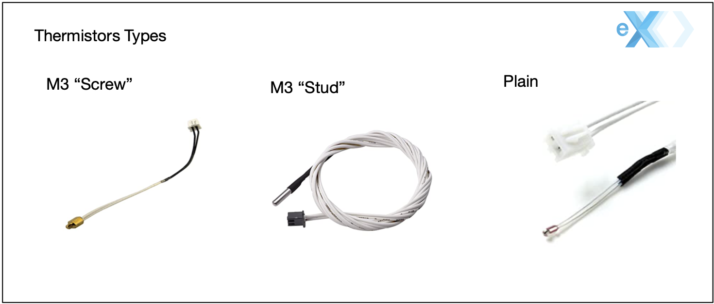

# All things Robo3D R1 Plus #

This is a collection of resources for [Robo3D R1 Plus]() owners in hope they can keep their printers supported and shugging on! 

> Some of the links to parts in Amazon use the Associate Program and commisions may be earned. Most links are for actual parts purchased that work for me. Links to parts are for reference, please do your research before buying.

I also added a page for my [Sunlu S8](sunlus8.md).

# Specs and Parts #

The R1 is pretty much a traditional [RAMPS 1.4](https://www.reprap.org/wiki/RAMPS_1.4) 3D printer as such is fairly easy to find parts and hack it.

## Kinematics ## 

**Motors**:<br>
The R1+ uses for NEMA-17 bi-polar stepper [motors](motors.md). Since the R1+ is based on a RAMPS 1.4 controller board any motor that works with RAMPS works on the Robo R1+.

The basic specs for a motor are 1.8° (200 steps), 5mm shaft, and can be rated up to 4.2V.  

Since a Robo use a RAMPS 1.4, max power is dictated by your motor's drivers (eg: [A4988](https://reprap.org/wiki/A4988)). In general it will be around 1.5A to 2A. It all depends on the quiality of the driver, heatsink and cooling. For an R1+ a power around 1.5 amps is more than enough.

> As a side note remember that the board can only handle so much current used by all its components, the overall total power rating of a RAMPS 1.4 board is around 5A, it will vary by board quality and PCB traces used, but still a good reference value.

The torque (holding torque) for motors should be around 45Ncm (64oz.in). The motor that needs the more torque is the extruder motor.

When looking for a replacement motor make sure you get a motor with a straight connector (see my [motor](motors.md) page for more details) to avoid having to change the connector. Also the [motor](motors.md) page has a good explanation on how to re-wire other motors to work on a R1+.


The motors use a 20 Teeth Timing Pulley (5mm ID shaft) for the belts. [Amazon Kit](https://amzn.to/3esJ3JX)

**Belts**:<br>
810 GT2 belts (GT2 Steps, 6mm wide, 2mm pitch). [Amazon Kit](https://amzn.to/3esJ3JX)

**Z-AXIS**:<br>
On the R1+ the z axis uses TR8-4 lead screws. Thats a trapezoidal acme screw in 8 mm diameter with a 4mm pitch (linear motion per full rotation).

The two tension screws with springs on the extruder are standard M4 screws 50mm in length.

The Z-Axis is stabilized by two 8mm linear rods one on each side. (Diameter is 8mm, Tolerance is G6, Length: 377mm).

**Y-AXIS(Bed)**<br>
Bearings LM8UU

810 GT2 belts (GT2 Steps, 6mm wide, 2mm pitch)

20 Teeth Timing Pulley (5mm ID shaft),  (I presume that it is 6mm wide pulley since the belt is 6mm but I havent check.)

The Y-Axis is framed by two 8mm linear rods. (Diameter is 8mm, Tolerance is G6, Length: 355mm).


**X-AXIS**<br>

The X-Axis carriage is horizontal version of the Pruisa i3 style carriage.

The X-Axis carriage rides in two 8mm linear rods. These rods are called precision rods. (Diameter is 8mm, Tolerance is G6, Length: 304mm).

4ea LM8UU bearings (24mm length, 15mm outside diameter, 8mm inside diameter) support the carriage on the 8mm linear rods.

The width of the carriage as a line form the center point of each bearing opening is 83mm.


## Arduino Board ##

The R1 uses a standard [Arduino MEGA 2560](https://amzn.to/3ewtlO4) board.


## RAMPS Board ##

The R1+ may come with a RAMPS 1.3 or RAMPS 1.4 board. These two boards are almost the same.

The R1+ board is based on a [RAMPS 1.4.3](https://reprap.org/wiki/RAMPS_1.4) design.


Board uses [Pololu A4988](https://amzn.to/3aoiO4p) drivers.

This board has a different placement and labeling of some connectors and it may confuse people:

On R1+ board the fan connects to a connector labeled "FAN0". This connector is actually connected to Arduino's PIN 9 like regular RAMPS and it corresponds to the D9 connector on a RAMPS board.

On R1+ board the extruder heater is connected to the plug labeled D9. This connector corresponds to the original D10 of RAMPS board and still responds to Arduino's PIN 10.

Here is a good [post](http://community.robo3d.com/index.php?threads/taking-the-r1-ramps-and-rewiring-to-make-generic-ramps-work.8356/) on the Robo's Forums about using a generic RAMPS board on a R1.

## Extruder ##

The extruder in the Robo R1+ is called a **direct drive** extrusion (vs **bowden** extrusion). In **direct extrusion** the extruder pushes the filament directly into the nozzle. In **bowden extrusion** the extruder is mounted somewhere else and filament is pushed through a PTFE Bowden tube to the nozzle.

The type of extruder in the R1 is known as a **Greg's Wade's Geared Extruder** for more info check this (page)[https://reprap.org/wiki/Genealogy_/_Archeology_of_the_Greg%27s_Wade%27s_Geared_Extruder]) to learn about the history of this extruder. This design was made popular with the Prusa i3 printers.


## Hot End ##

The R1+ comes with a **hexagon** hotend. This is a hotend for 1.75mm filaments. Compatible nozzles must have a M6 thread (1mm thread pitch) which are the most common online. The top collar/groove that holds the hotend to the X carriage in a Robo R1 is 4.2mm and is hold by a "Quick Release" bracket. 

I got this replacement [set](https://amzn.to/3cshheR) in amazon.

Thermistor is EPCOS 100k ohms, 4.7k pullup. You may use others but must be configured on the firmware.

Heater Cardrige is a 12v/30w.

Nozzles compatible with E3D V6 should also work with the stock hexagon hotend as long as its for 1.75mm filament. 

To replace the nozzle heat up the extruder, when is warm you can unscrew the nozzle. I use a 5/8 combination wrench to hold the block, be carefull with the cables for the heater catridge and thermosistor. Nozzles are usually 7mm I use a 9/36 socket to screw the nozzle in. The original nozzle may have enlongated sides so to remove it you may need an open wrench or pliers.

The fan, heater cardtrige, and thermistor are all connected with a JST-SM 2 pin connectors.

The nozzle to bed distance is 0.9mm.

When buying a replacement hotend there are many considerations in particular with clone and budget options found online. I found this guide quite usefull to help me shop around and prepare myself when I got a V6 clone from Amazon. 

Clone (budget) hotends that have the PTFE tubing go all the way into the heat break/nozzle throat tend to degrade rapidly and clog. Hotends with lined nozzle throats have lower tolerance to higher temperatures and depending on the quality degrade over time creating more clogs/jams. An "all metal" hotend is a better option and allows for higher temperatures, in this case the nozzle throat is not lined and no tubing goes inside.

E3D and Micro-Swiss sell heatbreaks that you can buy and replace the one that came in the budget hotend, you can also find titinium throats. Micro-Swiss has an affordable $12.99 throat that is plated with "TwinClad XT" to improve the smothness/lubrication. Work of caution is that your clone heat block and heat sink may NOT have the exact diameter as an original V6 so a M6 thread may not work for you.

When you get a clone/budget hotend you may wanna check that it its assemble propperly is common to find a nozzle throat upside down among other details that will give you troubles.


Available at:<br>
[Amazon](https://www.amazon.com/gp/product/B00W8FL5BS/ref=as_li_tl?ie=UTF8&camp=1789&creative=9325&creativeASIN=B00W8FL5BS&linkCode=as2&tag=ctk08-20&linkId=fb198b65e3dfeb2f29869fbcb71f9788)<br>
[ebay](https://ebay.us/intMEF)<br>
[reprapdiscount](http://www.reprapdiscount.com/hotends/67-hexagon-hotend-set.html)<br>
[partsbuilt](https://www.partsbuilt.com/r1-hotend-assembly-robo)<br>


## Themistor ##


The heat block on the stock hot end uses a 100k 4.7 pull-up thermistor. The default connector to the thermistor is a 2 pin **JST-SM** connector.

Thermistors come in three main packages:<br>


The thermistor in the stock hexagon hotend of the R1+ is plain thermistor glued to the heatblock. 

You can also use the **M3 stud** or **M3 screw** version but you may need to drill the heatblock to widen the hole.

> When buying a thermistor be carefull to ensure that what you are buying is infact a thermosistor. Many thermocouples also come in a "stud" package and are easy to confuse. The RAMP 1.4 board will NOT accept a thermocouple without a conditioner/amplifier board/adapter to make it them work, also there is little support in firmwares like Marlin.

In the Marlin firmware the thermistor setting is:
```
#define TEMP_SENSOR_0 1 
```

Other settings for common thermistors are:

A *Semitec 104GT2* thermistor is value 5 in the Marlin firmware.<br>
A *NTC 100K 1% 3950* thermistor is value 11 in the Marlin firmware.<br>
A *EPCOS 100k* thermistor is value 1 in the Marlin firmware, this is also the safest value for most 100k thermistors that cannt be identified.<br>

Check the section on the E3D V6 hotend for more info on thermistors.

For more info check this excellent [guide](https://reprap.org/wiki/Thermistor) at RepRap.org.

### Fan ###

The stock hotend fan specs are:<br>
12v Brushless Dc Mini Cooling Fan<br>
Dimensions: 25mm X 25mm X 10mm.<br>

The original fan has short cables that stress or get damage by heat. When the hotend fan is not working properly, heat can creap up the extruder throat melting the filament before it reaches the heating block causeing poor extrusion and clogs. 

Amazon [Option1](https://www.amazon.com/gp/product/B00MYNWUP4/ref=as_li_tl?ie=UTF8&camp=1789&creative=9325&creativeASIN=B00MYNWUP4&linkCode=as2&tag=ctk08-20&linkId=7be85f2de951dd2294e4c2b29786ce71)<br>


## Other Hotends ##

The [filament throats](https://reprap.org/forum/read.php?14,846189,846189) may be full metal or PTFE (teflon) lined.
A general accepted opinion is that PTFE lined throaths limits your tempetures (but for most people working with PLA thats is fine) and may cause jams. Example hotends with teflon: models HE280 and E3D V6 clones may also use PTFE. When possible stick to all aluminum/metal.

### E3D V6 Hotend Upgrade ###

The "Quick Release" bracket holding the hotend to the carriage in the R1+ is for 4.2mm slot/collar. The E3D V6 has a 6mm collar so it will be loose. An stl for a 6mm "Quick Release" bracket is availble [here](https://www.thingiverse.com/thing:1192896.

The V6 uses stud thermistors (M3) instead of bare thermistors. Depending on the thermistor of your hotend you may need to change the value of the constant `TEMP_SENSOR_0` in the "configuration.h" file of your Marlin firmware.

The thermistor on E3D V6 varies from an original to the clones found online. The original V6 uses a variant of Semitec 104GT2 (4.7k pullup) thermistor while some come with an upgraded PT100 (more sensitive). Many clones come with a NTC 100K %1 3950 or variant. Make sure you check which thermistor comes with your hotend.

The E3D V6 uses a PTFE tube that goes down the throat of the hotend. When using the stock extruder

[Robo Forum Post](http://community.robo3d.com/index.php?threads/e3d-v6-information-installation-guides-and-review.3407/)<br>
[Robo Forum Post](http://community.robo3d.com/index.php?threads/e3d-v6-information-and-installation-guide.17598/)<br>
[Novice Expert Assemble Youtube Video](https://www.youtube.com/watch?v=0FB3MmgvWrw)<br>
[Novice Expert Installation Youtube Video](https://www.youtube.com/watch?v=sZM6MIuPorQ)<br>


### Upgrade to Titan Extruder with stock hexagon or E3DV6 hotends ###

Forum discussion is available [here](http://community.robo3d.com/index.php?threads/e3d-titan-extruder.8246/).

https://www.thingiverse.com/thing:1528588
https://www.thingiverse.com/thing:1530555
https://www.thingiverse.com/thing:1521037
https://www.thingiverse.com/thing:1549206

Carriage assembly [stl](https://www.thingiverse.com/thing:1557214) in Thingiverse.

Options to buy:
[Amazon clone full assembly with motor](https://amzn.to/2VGxYg1)


# Power Supply #

The R1+ uses a common 3D Printer Switching Power Supply 12V 30A (360W, 15A, 120V-AC), ease to find if you search for S-360-12.

Amazon [Option1](https://amzn.to/2XIWFLl)<br>


# Firmware #

This is the last frimware published by Robo3D for the R1 Plus. It was fixed to compile in newer versions of the Arduino IDE.<br>
[Marlin 1.0](ROBO3DR1PLUSV2_9APR2020.zip)<br>


This is a vanilla Marlin 1.1.9 Frimware for the R1+. Thanks to [Marquis Johnson](https://www.youtube.com/channel/UCBGNc_mOP_amZNrNj6lAwHg) for providing this firmware, he also posted an excellent [video](https://www.youtube.com/watch?v=lgyjH1bbp1Q&t=212s).<br>
[Marlin 1.1.9](ROBO3DR1PLUSV1.1.9.zip)<br>


Marlin 1.1.9 Firware [discussion](http://community.robo3d.com/index.php?threads/marlin-1-1-9-release-for-robo-r1.22329/) at Robo's forums.


I have a project for a Marlin/RepRap like firmware which is especific for 3D printers built on RAMPS and Arduino like the R1+. This version is much smaller easier to configure, supports a more modern G-CODE and allows for easier extensions by means of hooks.<br>
[SRAMP Frimware](https://github.com/ctkjose/R1PLUSFIRMWARE)<br>


Robo3D [Github Repo](https://github.com/Robo3D/R1PlusMarlin) for R1.


# Software #

## MatterControl ##

MatterControl avaliable from [MatterHacker](https://www.matterhackers.com) was the original software bundled with Robo. The latest version is 2.0 (as of 27/JUNE/2020). MatterControl is more easier to use than Cura and making print profiles with different settings for your prints is super easy.

The slicer is MatterSlicer which is a branch from the original CuraEngine, it is written in C++ for performance and the github project is quite active. I havent had any issues using their slicer, actually I have got better results with MatterSlicer than Cura. 

For advance editing and preping you can look a [MeshMixer](http://www.meshmixer.com/download.html) as a companion. Is great for [things](https://formlabs.com/blog/meshmixer-tutorial-tips-to-edit-stl-files-for-3d-printing/) like hollowing, fine control of support points and mesh repairs.

MatterControl comes with a printer profile for the Robo R1+.

## Cura R1 Profile ##

Zip [file](CURA_CFG01.zip) with config.<br>
Drop the robo3dr1_platform.stl into meshes folder and robo3dr1.json into machines folder

[Forum Discussion](http://community.robo3d.com/index.php?threads/cura-setup.23834/)
[Forum Discussion Older](http://community.robo3d.com/index.php?threads/cura-2-r1-setup.17126/)


# Tutorial and Mods #

## Printing from SD Card, Option 1 ##

Export your print to a gocode file.

Insert the SD card in your computer.

Copy the gcode file to the root of the sd card using the following name "auto0.g".

Turn off your R1 printer.

Insert the sd card in your printer.

Turn on your printer. Wait the print will start automatically.

## Printing from SD Card, Option 2 ##

Newer versions of Matter Control no longer have SD Card support. If you export your gcode to an sdcard you can print the file from MatterControl.

Insert the SD Card, from MatterControl connect to your printer if you havent already.

In the Terminal tab enter the following commands:
```
M21; init SD Card
M32: P !myfile.gco; 
```
The print should start shortly. You may disconnect from the printer now.


## LCD ##
[Smart LCD Controller Robo](https://www.youtube.com/watch?v=8yWX7Pn-Sg0)

## Heating bed ##

Ramsey Gill's [100W Heating bed](https://hackaday.io/project/161487-upgrade-robo3d-r1-heated-bed-100w)

## Magnetic removable build surfaces ##

I got me a cheap removable magnetic build surfaces from amazon for $10, mine is a 220mm x 220mm. The 220 x 220 matches the outlined white square in the R1+ print bed. The quality of mine is ok, but I have yet to see how long it will last. I see some scaring already, but anyhow this is how I got it to work.

To use this we have to limit the bounds of the rectangle used in auto bed leveling. I modified my "Configuration.h" to have the following bounds: 
```
    // set the rectangle in which to probe
    #define LEFT_PROBE_BED_POSITION 15
    #define RIGHT_PROBE_BED_POSITION 190
    #define BACK_PROBE_BED_POSITION 190
    #define FRONT_PROBE_BED_POSITION 15
```
I saved and uploaded my firmware.

The next thing to do is to adjust your Z Offset. In Matter Control I have a `M565` code in my start gcode:
```
M565 Z-0.9; Z-AXIS OFFSET
```
This line is before the `G29` code. In my original setup with a plain bed I had `-0.9` as my offset. Since the bed is almost 2mm I adjusted that to `1.1` (`2-0.9 = 1.1`). After a test 1.1 is encrunshing a bit much so I played a bit and end up with this line:
```
M565 Z1.2; Z-AXIS OFFSET
```


# STL Files for R1+ Parts #

My personal [collection](https://www.thingiverse.com/jcuevas/collections/robo3dr1) of STL files related to the Robo3D R1 in [Thingiverse](https://www.thingiverse.com/jcuevas/collections/robo3dr1).

Replacement carriage for mounting a E3D V6. [link](https://www.thingiverse.com/thing:1411833)<br>

Fan mount for stock hexagon extruder and carriage. [link](https://www.thingiverse.com/thing:1374049)<br>


# Other links #

Thingiverse Robo3D [Forum](https://www.thingiverse.com/groups/robo-3d)<br>

Robo3D's Community [Forum](http://community.robo3d.com/index.php)<br>

This is a great FAQ [post](http://community.robo3d.com/index.php?threads/faq-r1-r1-series-printers.19735/) at Robo3D's forum for R1 owners. 

Check this [post](http://community.robo3d.com/index.php?threads/robo3d-replacements-and-upgrades-thread.6677/) for a good collection of information regarding repairs and parts found across the Robo's forum.


# PARTS #

| Part | Use | Notes |
| -- | -- | -- |
| JST-SM 2 pin connectors | fan, heater cardtrige, and thermistor | |
| LM8UU bearings | X Carriage | |
