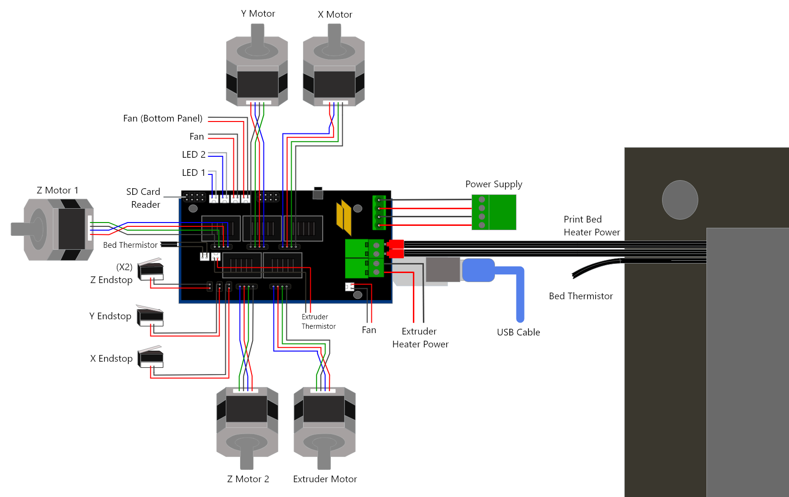

# All things Robo3D R1 Plus #

This is a collection of resources for [Robo3D R1 Plus]() owners in hope they can keep their printers supported and shugging on!

# Specs and Parts #

The R1 is pretty much a traditional RAMPS 1.4 3D printer as such is fairly easy to find parts and hack it.

**Motors**:<br>
R1+ uses Nema17 Stepper Motor.

**Belts**:<br>
810 GT2 belts. 

**Z-AXIS**:<br>
On the R1+ the z axis uses TR8-4 lead screws. Thats a trapezoidal acme screw in 8 mm diameter with a 4mm pitch (linear motion per full rotation).

**Y_AXIS(Bed)**<br>
Bearings LM8UU, belt 810 GT2.

Linear solid rods: 8mm

The two tension screws with springs on the extruder are standard M4 screws 50mm in length.

## Arduino Board ##

The R1 uses a standard [Arduino MEGA 2560](https://amzn.to/3ewtlO4) board.

## RAMPS Board ##
The R1+ may come with a RAMPS 1.3 or RAMPS 1.4 board. These two boards are almost the same.

The R1+ board is based on a [RAMPS 1.4.3](https://reprap.org/wiki/RAMPS_1.4) design.


Board uses [Pololu A4988](https://amzn.to/3aoiO4p) drivers.

This board has a different placement and labeling of some connectors and it may confuse people:

On R1+ board the fan connects to a connector labeled "FAN0". This connector is actually connected to Arduino's PIN 9 like regular RAMPS and it corresponds to the D9 connector on a RAMPS board.

On R1+ board the extruder heater is connected to the plug labeled D9. This connector corresponds to the original D10 of RAMPS board and still responds to Arduino's PIN 10.

Here is a good [post](http://community.robo3d.com/index.php?threads/taking-the-r1-ramps-and-rewiring-to-make-generic-ramps-work.8356/) on the Robo's Forums about using a generic RAMPS board on a R1.


## Hot End ##

The R1+ comes with a "hexagon hotend".

The nozzle is a 0.4mm for 1.75mm filament, a M6 thread, 1mm thread pitch. I got this replacement [set](https://amzn.to/3cshheR) in amazon.

Thermistor is EPCOS 100k ohms, 4.7k pullup. You may use others but must be configured on the firmware.

Heater Cardrige is a 12v/30w. 

Nozzles compatible with E3D V6 should also work with the stock hexagon hotend as long as its for 1.75mm filament.

The nozzle to bed distance is 0.9mm.

Available at:<br>
[Amazon](https://www.amazon.com/gp/product/B00W8FL5BS/ref=as_li_tl?ie=UTF8&camp=1789&creative=9325&creativeASIN=B00W8FL5BS&linkCode=as2&tag=ctk08-20&linkId=fb198b65e3dfeb2f29869fbcb71f9788)<br>
[reprapdiscount](http://www.reprapdiscount.com/hotends/67-hexagon-hotend-set.html)<br>
[partsbuilt](https://www.partsbuilt.com/r1-hotend-assembly-robo)<br>


### Fan ###

The stock hot end fan specs are:<br>
12v Brushless Dc Mini Cooling Fan<br>
Dimensions: 25mm X 25mm X 10mm.<br>

The original fan has short cables that stress or get damage by heat. When the hotend fan is not working properly, heat can creap up the extruder throat melting the filament before it reaches the heating block causeing poor extrusion and clogs. 

Amazon [Option1](https://www.amazon.com/gp/product/B00MYNWUP4/ref=as_li_tl?ie=UTF8&camp=1789&creative=9325&creativeASIN=B00MYNWUP4&linkCode=as2&tag=ctk08-20&linkId=7be85f2de951dd2294e4c2b29786ce71)<br>


## Other Hotends ##

The [filament throats](https://reprap.org/forum/read.php?14,846189,846189) may be full metal or PTFE (teflon) lined.
A general accepted opinion is that PTFE lined throaths limits your tempetures (but for most people working with PLA thats is fine) and may cause jams. Example hotends with teflon: models HE280 and E3D V6 clones may also use PTFE. When possible stick to all aluminum/metal.

### E3D V6 Hotend Upgrade ###

[Robo Forum Post](http://community.robo3d.com/index.php?threads/e3d-v6-information-installation-guides-and-review.3407/)<br>
[Robo Forum Post](http://community.robo3d.com/index.php?threads/e3d-v6-information-and-installation-guide.17598/)<br>
[Novice Expert Assemble Youtube Video](https://www.youtube.com/watch?v=0FB3MmgvWrw)<br>
[Novice Expert Installation Youtube Video](https://www.youtube.com/watch?v=sZM6MIuPorQ)<br>

### E3D V6 Titan ###

Carriage assembly [stl](https://www.thingiverse.com/thing:1557214) in Thingiverse.

Options to buy:
[Amazon clone full assembly with motor](https://amzn.to/2VGxYg1)


# Power Supply #

The R1+ uses a common 3D Printer Switching Power Supply 12V 30A (360W, 15A, 120V-AC), ease to find only if you serach for S-360-12.

Amazon [Option1](https://amzn.to/2XIWFLl)<br>


# Firmware #

This is the last frimware published by Robo3D for the R1 Plus. It was fixed to compile in newer versions of the Arduino IDE.<br>
[Marlin 1.0](ROBO3DR1PLUSV2_9APR2020.zip)<br>


This is a vanilla Marlin 1.1.9 Frimware for the R1+. Thanks to [Marquis Johnson](https://www.youtube.com/channel/UCBGNc_mOP_amZNrNj6lAwHg) for providing this firmware, he also posted an excellent [video](https://www.youtube.com/watch?v=lgyjH1bbp1Q&t=212s).<br>
[Marlin 1.1.9](ROBO3DR1PLUSV1.1.9.zip)<br>


Marlin 1.1.9 Firware [discussion](http://community.robo3d.com/index.php?threads/marlin-1-1-9-release-for-robo-r1.22329/) at Robo's forums.


I have a project for a Marlin/RepRap like firmware which is especific for 3D printers built on RAMPS and Arduino like the R1+. This version is much smaller easier to configure, supports a more modern G-CODE and allows for easier extensions by means of hooks.<br>
[SRAMP Frimware](https://github.com/ctkjose/R1PLUSFIRMWARE)<br>


Robo3D [Github Repo](https://github.com/Robo3D/R1PlusMarlin) for R1.

# Software #

## MatterControl ##


## Cura R1 Profile ##

Zip [file](CURA_CFG01.zip) with config.<br>
Drop the robo3dr1_platform.stl into meshes folder and robo3dr1.json into machines folder

[Forum Discussion](http://community.robo3d.com/index.php?threads/cura-setup.23834/)
[Forum Discussion Older](http://community.robo3d.com/index.php?threads/cura-2-r1-setup.17126/)


# Tutorial and Mods #

## Printing from SD Card, Option 1 ##

Export your print to a gocode file.

Insert the SD card in your computer.

Copy the gcode file to the root of the sd card using the following name "auto0.g".

Turn off your R1 printer.

Insert the sd card in your printer.

Turn on your printer. Wait the print will start automatically.

## Printing from SD Card, Option 2 ##

Newer versions of Matter Control no longer have SD Card support. If you export your gcode to an sdcard you can print the file from MatterControl.

Insert the SD Card, from MatterControl connect to your printer if you havent already.

In the Terminal tab enter the following commands:
```
M21; init SD Card
M32: P !myfile.gco; 
```
The print should start shortly. You may disconnect from the printer now.


## LCD ##
[Smart LCD Controller Robo](https://www.youtube.com/watch?v=8yWX7Pn-Sg0)

## Heating bed ##

Ramsey Gill's [100W Heating bed](https://hackaday.io/project/161487-upgrade-robo3d-r1-heated-bed-100w)

## Magnetic removable build surfaces ##

I got me a cheap removable magnetic build surfaces from amazon for $10, mine is a 220mm x 220mm. The 220 x 220 matches the outlined white square in the R1+ print bed. The quality of mine is ok, but I have yet to see how long it will last. I see some scaring already, but anyhow this is how I got it to work.

To use this we have to limit the bounds of the rectangle used in auto bed leveling. I modified my "Configuration.h" to have the following bounds: 
```
    // set the rectangle in which to probe
    #define LEFT_PROBE_BED_POSITION 15
    #define RIGHT_PROBE_BED_POSITION 190
    #define BACK_PROBE_BED_POSITION 190
    #define FRONT_PROBE_BED_POSITION 15
```
I saved and uploaded my firmware.

The next thing to do is to adjust your Z Offset. In Matter Control I have a `M565` code in my start gcode:
```
M565 Z-0.9; Z-AXIS OFFSET
```
This line is before the `G29` code. In my original setup with a plain bed I had `-0.9` as my offset. Since the bed is almost 2mm I adjusted that to `1.1` (`2-0.9 = 1.1`). After a test 1.1 is encrunshing a bit much so I played a bit and end up with this line:
```
M565 Z1.2; Z-AXIS OFFSET
```


# STL Files for R1+ Parts #

My personal [collection](https://www.thingiverse.com/jcuevas/collections/robo3dr1) of STL files related to the Robo3D R1 in [Thingiverse](https://www.thingiverse.com/jcuevas/collections/robo3dr1).

Replacement carriage for mounting a E3D V6. [link](https://www.thingiverse.com/thing:1411833)<br>

Fan mount for stock hexagon extruder and carriage. [link](https://www.thingiverse.com/thing:1374049)<br>


# Other links #


Thingiverse Robo3D [Forum](https://www.thingiverse.com/groups/robo-3d)<br>

Robo3D's Community [Forum](http://community.robo3d.com/index.php)<br>

Check this [post](http://community.robo3d.com/index.php?threads/robo3d-replacements-and-upgrades-thread.6677/) for a good collection of information regarding repairs and parts found across the Robo's forum.

