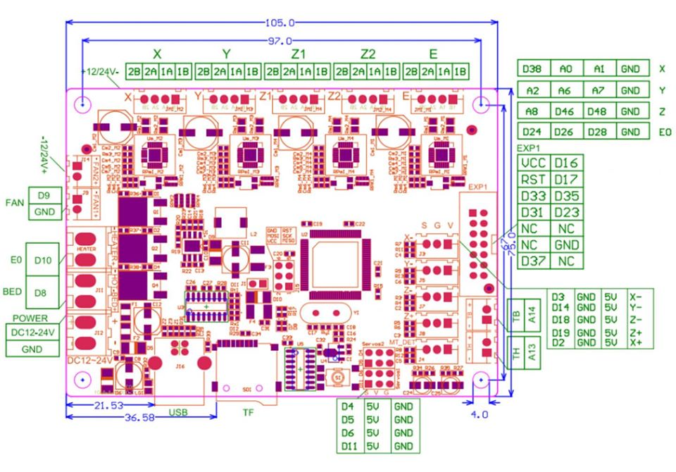
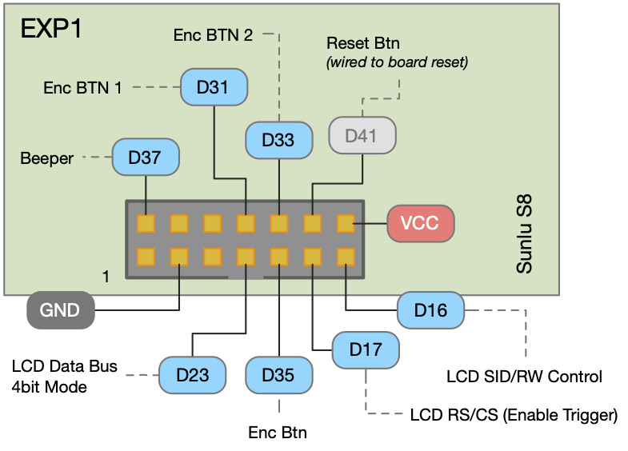
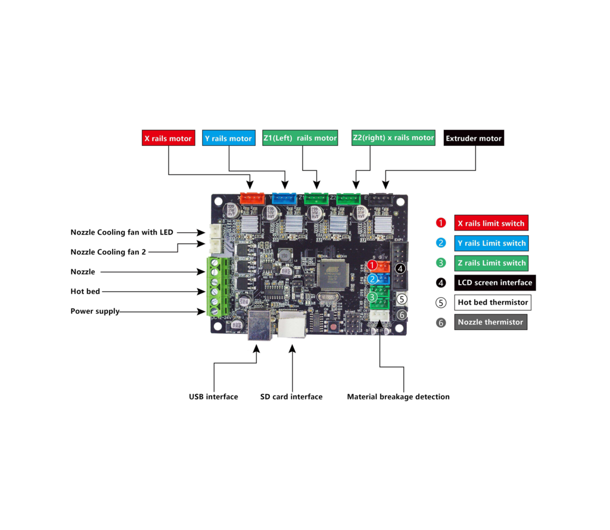

# Sunlu S8 #

This is a collection of resources for [Sunlu's S8]() owners in hope they can keep their printers supported and shugging on! 

The Sunlu S8 follows the design (same kinematics) as the Ender 3 and CR-10S printers, size wise the S8 is like an CR10S.

## Kinematics ## 

### Mainboard ###

The printer uses a [MKS](https://reprap.org/wiki/MKS_GEN_V1.1) like board. When it comes to asthetics and layout the board is mostly a cross-over with of  Creality CR10 boards, MKS Base 1.X and SKR.

For more details on the pinout check my [RAMPS Pinout Page](ramps_mainboard.md). 

The board has a EXP1 connector for the Smart Controller LCD, the following image has its pinout:

Like most of the 8Bit boards out there, this is in escence is just a [RAMPS 1.4](https://reprap.org/wiki/RAMPS_1.4) board with an integrated Arduino 2560 all in one board. The main differances are:

- The board uses a L5970D power regulator allowing it to operate at 24V. Operating at 24V allows the hot-end and bed heater to use less current (about .25 less).

- This board only has support for one extruder.

References: 
[MKS GEN at GitHub](https://github.com/makerbase-mks/MKS-GEN/) 
[MKS GEN V1.4](https://github.com/makerbase-mks/MKS-GEN/blob/master/hardware/MKS%20GEN%20V1.4_004/MKS%20GEN%20V1.4_004%20PIN.pdf) 

The pin configuration for this board is the same as the RAMPS 1.4 in the Marlin Firmware.

The board uses [Pololu A4988](https://amzn.to/3aoiO4p) drivers. They are non replacable soldered in the board.

### Motors: ###
The S8 uses for NEMA-17 bi-polar stepper [motors](motors.md). Since the S8 is based on a RAMPS 1.4 controller board any motor that works with RAMPS works on the S8.

## Extruder ##

The extruder in the S8 is called a **bowden** extrusion (vs **direct drive** extrusion). In **bowden extrusion** the extruder pushes the filament through a PTFE Bowden tube into the MK8 nozzle. The extruder is mounted in the side of the printer. directly into the nozzle. In **direct drive extrusion** the extruder is mounted with the nozzle and the filament is pushed directly into the nozzle.

The extruder in the S8 is called a **"MK8 extruder drive"**. It uses a 40 teeth gear attached to the motor shaft to push the filament. Any MK8 extruder drive meant for Ender 3/3Pro CR-10, CR-10 S4 or CR-10 S5 will fit the S8.

This is [my guide](sunlus8_microswiss_direct_drive_extruder.md) on upgrading to a Micro Swiss Direct Drive extruder.

## Hotend ##

The hotend is a MK8. The stock hotend has an aluminum cooling block. One good design choice in the S8 is that the throut into the heating block is a PTFE lined screw that goes from the top directly to the heating block, this helps avoid leaks and clogging.

The heater block is also aluminum with a standrad 4.0mm brass plated noozle.

## Cooling Fans ##

The Cooling Fan on the S8 is a 40mm x 40mm x 10mm fan. It is a 24V and should be rated around 0.6A.

## Power Supply ##

The S8 uses a standard 24V power supply found in many 3D printers. The power supply is rated at 360W and delivers from to 14.6A to 15A depending in the model that came in your printer.

To find a replacement just  search for "360w 24v 3d printer power supply" you will find a lot of options. The case is around 4.52in x 8.64in which is the common dimensions for a 3D printer power supply. The amperage of your power supply may be higher than 15A and thats ok. For better performance check that the replacement has a fan and even better if the fan is automatic (is off by default and turn-on only when the power supply is hot).

## Bed Leveling ##

I created a guide of how I got my S8's bed level. It includes some pointer on how to handle the captchas. The guide is available [here](SUNLUS8_BED_LEVELING.pdf).

The basic steps to level the bed on your Sunlu S8 are available [here](https://www.youtube.com/watch?v=ail-0E_LtV0) in a YouTube video form Sunlu, you may also want to watch other videos on YouTube that cover more details. Also the steps to level the bed in the S8 are the same for Ender 3 and CR10 printers.

I like this video in particular:

[Thomas Sanladerer](https://www.youtube.com/watch?v=AaF28dnDgKA)

## Issues ##

The Sunlu S8 is an affordable printer, yet some units come with issues that you need to look out for.

Make sure all the axis are thight and there is no wiggle. 

Check your noozle carriage and if it has an up and down wiggle, thight the ecentric nut at the bottom using the wrench provided, turn clockwise to tighten it.

Check the bed to see if there is wiggle to the sides, if so under you will find two ecentric nuts one on each of the plates holding the bed, the ecentric nuts are the ones in the inside. Start by tighting one and checking before tightening the other one.

Do the same with the Y axis.

When you put together the printer make sure that your X-Z gantry is square. I used a carpenter square to ensure the vertical t-2040 slots are square with the base.

In my case a limit switch had the paddle loose. Check your limit switches to ensure the metal paddle sits properly in the slot. You also have a spare switch that came with the printer.

Springs in the bed do NOT offer enough tension which makes it difficult to level the bed and to keep the bed leveled. Putting one or more nuts (or washers) allows a temporary fix to give you more tension to level the bed. By my experience and comments of others this is the first thing you need to replace if you want a happy relationship with this printer. Get some sturdy 20mm or 25mm springs, same as the ones used on CR10 and Ender3 printers.
